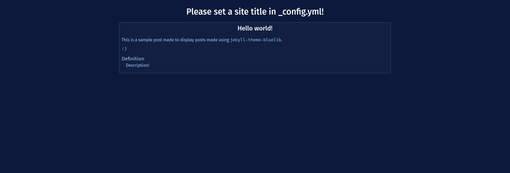

# jekyll-theme-bluelib

A theme providing Bluelib themes on Jekyll static sites!



## Installation

Add this line to your Jekyll site's `Gemfile`:

```ruby
gem "jekyll-theme-bluelib"
```

And add this line to your Jekyll site's `_config.yml`:

```yaml
theme: jekyll-theme-bluelib
```

And then execute:

```console
$ bundle
```

Or install it yourself as:

```console 
$ gem install jekyll-theme-bluelib
```

After installing, add to `_config.yml` the name of your preferred bluelib theme:
```yml 
bluelib: "royalblue"
```

## Usage

The theme provides four layouts: `default`, `base`, `box` and `post`.

### `default`

Default is the simplest layout of the four, and only adds the bluelib stylesheets for the theme to be displayed.

In particular, it `<link>`s in the following order:

1. The `skeleton.root.css` from the latest version of bluelib
2. The bluelib `root` target defined in the `bluelib` variable of `_config.yml` (`site.bluelib`)
3. The bluelib `root` target defined in the `bluelib` variable of the Front Matter of the page (`page.bluelib`)

### `base`

Base adds some elements to the `default` layout: 

- it adds a `layout-threecol` to the page
- it centers the page `contents` by using `layout-threecol-center` 
- it renders the `title` defined in `_config.yml` as a `<h1>` element before the contents

### `box`

Box wraps the `contents` of the page in a `panel panel-box`.

### `post`

Post extends the `box` layout by adding the `page.title` to the top of the box, rendered as a `<h2>` element.

## Development

To set up your environment to develop this theme, run `bundle install`.

Your theme is setup just like a normal Jekyll site! To test your theme, run `bundle exec jekyll serve` and open your browser at `http://localhost:4000`. This starts a Jekyll server using your theme. Add pages, documents, data, etc. like normal to test your theme's contents. As you make modifications to your theme and to your content, your site will regenerate and you should see the changes in the browser after a refresh, just like normal.

When your theme is released, only the files in `_layouts`, `_includes`, `_sass` and `assets` tracked with Git will be bundled.
To add a custom directory to your theme-gem, please edit the regexp in `jekyll-theme-bluelib.gemspec` accordingly.
